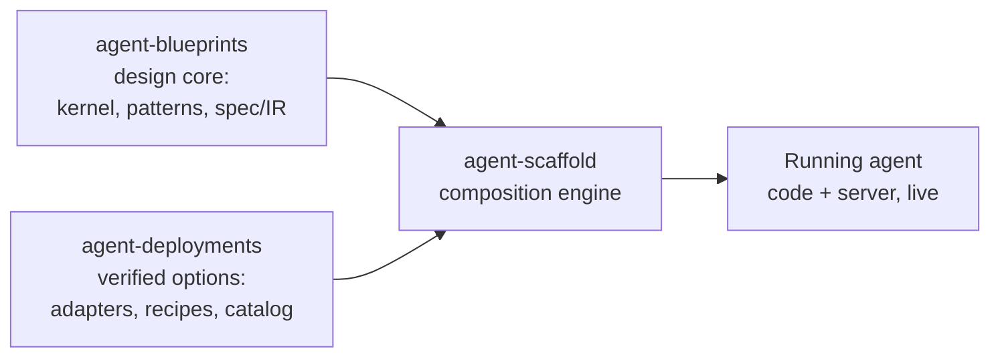
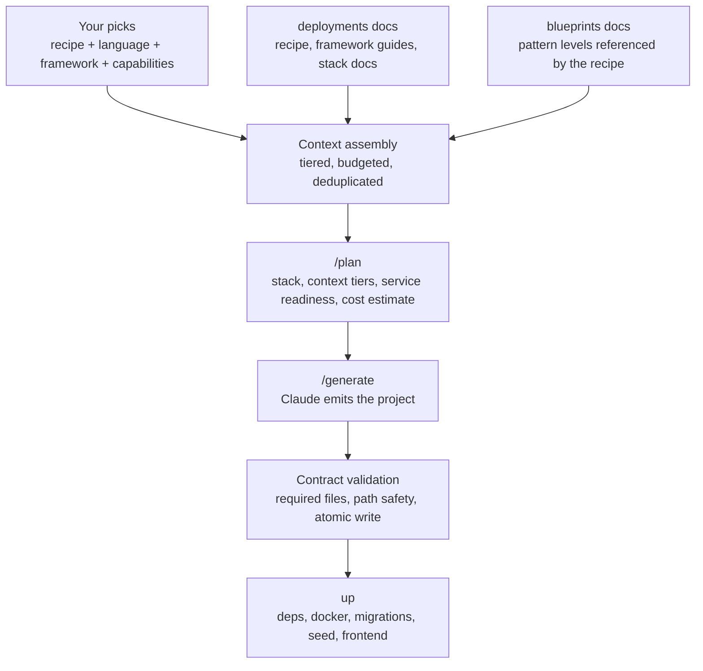

# The ecosystem

Agent Scaffold CLI is the engine of a three-repo toolchain. The other two repos are not stages in a sequence — they are **two arms that feed the engine in parallel**, and the engine composes what they provide into a running agent.

## What each arm contributes

**[agent-blueprints](https://github.com/jagguvarma15/agent-blueprints) — the design core.** The kernel every agent composes onto (Step, Engine, Control-Policy, Run-State, Ports, Cross-cutting), framework-agnostic patterns documented at five levels of depth (Concepts, Architecture, Flow, Design, Implementation), and the spec/IR a selection compiles to. It answers *what the agent is and how it's shaped* — the cognitive flow, before any framework or infrastructure choice exists.

**[agent-deployments](https://github.com/jagguvarma15/agent-deployments) — the verified options.** A port-typed registry of vetted adapters (frameworks, model providers, stores, deploy targets, observability, guardrails) that bind to the kernel's ports, plus production-shaped recipes. Its `catalog.yaml` is the machine-readable **menu**: every recipe, capability, compatibility edge, and a per-recipe context manifest — the exact, pre-costed doc set to load. It answers *which concrete options realize each port*.

**[agent-scaffold](https://github.com/jagguvarma15/agent-scaffold) — the composition engine (this CLI).** Validates a selection, binds each port to a deployments option, asks Claude for the complete project, validates the response, and writes it atomically. It cooks the agent.

The boundary: blueprints owns the *design-time* shape, deployments owns the *operational realization*, and the kernel's **ports** are the seam where the two meet. That is why the flow is not sequential — a recipe (deployments) references pattern docs (blueprints), and the CLI pulls both sides together at generation time.

## How the arms funnel into plan and generate

Everything the two arms publish converges on one context, one plan, one generation:

Step by step:

1. **Selection.** You pick a recipe, a target language, a framework, and any capability changes — via the [interactive shell](getting-started/interactive-shell.md), the `/new` wizard, or `agent-scaffold new` flags. The catalog validates every pick.
2. **Context assembly.** The CLI fetches both arms ([auto-fetched and cached by commit](guides/content-sources.md)), resolves the recipe's context manifest, rewrites blueprint links so the model reads the canonical pattern content, and packs it all into a tiered, token-budgeted context.
3. **Plan.** `/plan` shows exactly what will ship before any tokens are spent: the resolved capability stack with delivery modes, the context tier breakdown, per-service readiness probes, and the cost estimate.
4. **Generate.** Claude emits the complete project as a structured contract; the CLI validates required files and path safety, then stages everything to a temp directory and moves it into place atomically — a failure leaves your destination untouched.
5. **Run.** By default generation chains straight into [`up`](guides/project-lifecycle.md): install dependencies, start docker services, wire credentials, run migrations, seed data, launch the frontend, open the browser.

## Where the CLI lives

The engine is published on PyPI as [`agent-scaffold-cli`](https://pypi.org/project/agent-scaffold-cli/) — see [Installation](getting-started/installation.md). The two content arms are never installed: they are fetched at runtime from GitHub and cached by commit SHA, so new recipes, adapters, and patterns reach you without upgrading the CLI.
