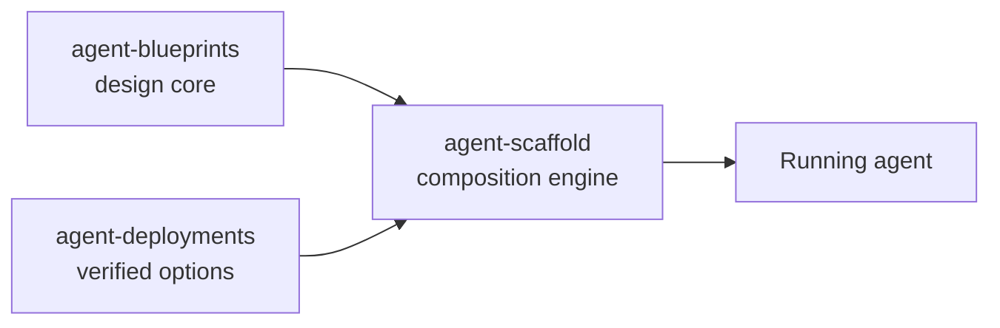

# Agent Scaffold CLI

Generate runnable AI agent projects from markdown specs. Pick a recipe, a target language, and a framework — the CLI assembles the relevant docs, asks Claude to emit a complete project, validates the response, and writes the files atomically into your destination of choice.

Published on PyPI as [`agent-scaffold-cli`](https://pypi.org/project/agent-scaffold-cli/); the content it composes is fetched live from its two sibling repos, so new recipes and adapters reach you without upgrading.

## Install

```bash
curl -fsSL https://raw.githubusercontent.com/jagguvarma15/agent-scaffold/main/install.sh | sh
```

The one-liner installs the CLI, puts it on your PATH, and offers to store your Anthropic key. Prefer pipx or uv, or want a one-off run without installing? See [Installation](getting-started/installation.md).

## What you get

**Spec to running project.** A recipe is a production-shaped markdown spec, not a code template. The generator reads it together with framework guides and architecture patterns, asks Claude for the complete project, validates the response against a contract (required files, path safety, static lint, build, smoke check), and stages every file to a temp directory before atomically moving it into place — a failed generation leaves your destination untouched.

**One command to a running stack.** By default `new` chains straight into provisioning: install dependencies, start docker services, wire credentials, run migrations, seed dev data, launch the frontend, open the browser. The [interactive shell](getting-started/interactive-shell.md) keeps the session alive afterwards for `/up`, `/status`, `/connect`, and `/down`.

**Secrets handled properly.** A nine-rule hardening model governs every credential the CLI touches: keyring-first storage with a mode-0600 file fallback, no secrets in argv, output redaction, enforced `.gitignore`, and first-class revocation — each rule locked in by an audit test. See the [security model](design/security.md).

## Two arms, one engine

This CLI is the composition engine of a three-repo toolchain — the other two feed it in parallel:



- [agent-blueprints](https://github.com/jagguvarma15/agent-blueprints) — the design core: the kernel, framework-agnostic patterns at five levels, and the spec/IR. *What the agent is.*
- [agent-deployments](https://github.com/jagguvarma15/agent-deployments) — the verified options: port-typed adapters and production-shaped recipes, indexed by `catalog.yaml`. *Which options realize each port.*
- [agent-scaffold](https://github.com/jagguvarma15/agent-scaffold) — this CLI, which composes a selection from both arms into a running project.

Read [The ecosystem](ecosystem.md) for how the two arms funnel into `/plan` and `/generate`, and [Capabilities](capabilities.md) for the layers, tiers, and bundles you compose from.

## Next steps

- [Quickstart](getting-started/quickstart.md) — from API key to a running agent.
- [Interactive shell](getting-started/interactive-shell.md) — the recommended way to work.
- [CLI commands](reference/cli.md) and [shell commands](reference/repl.md) — every command.
